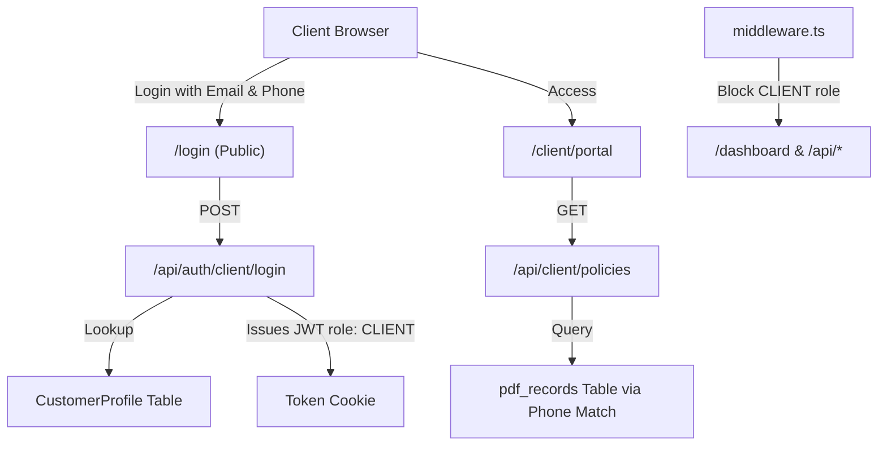

# Decoupled Customer Portal Walkthrough

The Customer Portal has been designed as a completely separate entity from the internal staff CRM. It does not touch the database schemas (`prisma/schema.prisma`), user roles, or staff authentication tables.

## Architecture & Data Decoupling

1. **Prisma & Schema Safety**: The CRM database and Prisma schema remain completely untouched.
2. **Session Identification**:
   - Client authentication utilizes a specialized JWT token containing `role: "CLIENT"` and the mapped `customerId`.
   - The token contains no `userId`, bypassing database lookup checks in `refreshUserClaims` and keeping database overhead low.
3. **Route & API Isolation**:
   - Staff routes (`/dashboard`, etc.) and staff CRM APIs are guarded via `middleware.ts`. Clients calling them are rejected with `403 Forbidden` or redirect blocks.
   - Staff login at `/crm/admin/login` uses email and password to log in.
   - Client login at `/login` uses email and phone number to access the portal.

## Claims Intake & Page Redesign
To make the claims page fully data-driven rather than an informational page:
- **Initiate Claim Form**: Allows clients to report new claims by selecting from their active policies, entering a Date of Loss, and describing the incident.
- **Dynamic Claims Progress Card**: Clicking on a claim in the Claims Log opens the live tracker showing real-time CRM updates (`claimStatus`, `claimDate`, associated policy number, `followUpDate` next review, and `currentRemark` latest desk updates).
- **Removal of Static Components**: Removed the generic progress timeline, the informational FAQ accordions, and the Bhopal cashless partner garages list.
- **Cascading Style Safeguards**: Styled all green background tags and buttons with specific `.force-white` overrides to ensure legible white text and prevent global stylesheet overrides from turning text black.

## File Summary

- [login/page.js](../../src/app/login/page.js): Custom Client Login form.
- [route.js](../../src/app/api/auth/client/login/route.js): Dedicated Client Login API.
- [route.js](../../src/app/api/client/policies/route.js): Client-only policies lookup matching phone suffix.
- [route.js](../../src/app/api/client/profile/route.js): Client profile info API.
- [route.js](../../src/app/api/client/claims/route.js): Secure client-initiated claims API handler.
- [page.js](../../src/app/client/portal/page.js): Dashboard UI displaying policies, claims, consulting CTAs, and dynamic claim operations tracking.
- [middleware.ts](../../src/middleware.ts): Role-based routing and CRM API restriction guards.
- [globals.css](../../src/app/globals.css): Appended `.force-` utility classes to bypass global black text locks.
